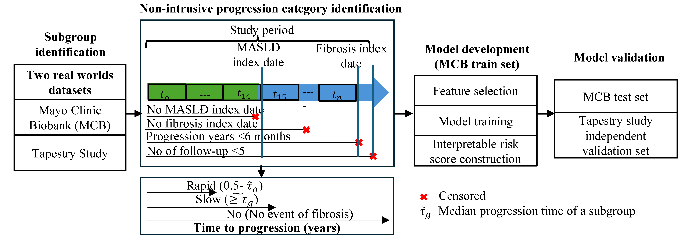

# MASLD pRFPS Prediction Pipeline
 

This repository contains the Python code for predicting rapid fibrosis progression in MASLD (Metabolic Dysfunction-Associated Steatotic Liver Disease) using a subgroup-specific interpretable risk score — **pRFPS**. The pipeline trains ML models on LCA-derived patient subgroups and derives clinically actionable risk scores via SHAP values.

> **Note:** Data from the Mayo Clinic Biobank (MCB) and Tapestry cohorts are not publicly available due to privacy restrictions.

---

## Overview


*Figure: Overview of the partitioned framework for rapid fibrosis-progression prediction.*
The analysis is structured into four components:

1. **Data preparation** — loading, preprocessing, and FIB-4 computation
2. **Subgroup-specific model training** — individual classifiers (RF, XGBoost, LightGBM, LR, etc.) tuned via GridSearchCV across LS and CM subgroups
3. **pRFPS score construction** — SHAP values from the best model converted to an interpretable integer risk score with clinically meaningful thresholds
4. **Validation** — external validation on the Tapestry cohort with covariate shift analysis and pRFPS vs FIB-4 comparison

---

## pRFPS Score Formulas

<!-- Add score derivation figure here -->

**pRFPS-LS** · Liver-Specific subgroup · Cutoff = 15
```
10·I(Age > 45) + 5·I(BUN > 21) + 5·I(ALP > 109) + 3·I(Platelet < 125) + 3·I(HDL < 61)
```

**pRFPS-CM** · Cardiometabolic subgroup · Cutoff = 18
```
10·I(ALP > 97) + 6·I(Platelet < 313) + 1·I(LDL > 64) + 1·I(Albumin < 13) + 1·I(AST > 39)
```

---

## Study Design

| Cohort | Role | Subgroups |
|--------|------|-----------|
| Mayo Clinic Biobank (MCB) | Discovery + internal validation | LS (Liver-Specific), CM (Cardiometabolic) |
| Tapestry Study | External validation | LS, CM |

Subgroups are identified by latent class analysis (LCA) run separately — see the companion [R repository](#) for that step.

---

## How to Run

### Prerequisites

- Python ≥ 3.9
- Packages: `scikit-learn`, `numpy`, `pandas`, `matplotlib`, `shap`, `xgboost`, `lightgbm`

### Step 1: Clone the Repository

```bash
git clone https://github.com/<your-username>/masld-phenotype-ml.git
cd masld-phenotype-ml
```

### Step 2: Install Dependencies

```bash
pip install -r requirements.txt
```

### Step 3: Prepare Data

Place your data files in the `data/` directory:
- `data/mcb_data.csv` — MCB cohort (tab-separated)
- `data/tapestry_data.csv` — Tapestry cohort (tab-separated)

See `data/README.md` for column specification and encoding details.

### Step 4: Run the Pipeline

```bash
python src/main.py --data data/mcb_data.csv --val data/tapestry_data.csv
```

Results are saved to a timestamped folder under `results/`.

---

## Repository Structure

```
masld-phenotype-ml/
├── src/                           # Modular package
│   ├── main.py                    # Orchestrates all modules
│   ├── config.py                  # Constants: column names, labels, model grid
│   ├── utils.py                   # Data loading, FIB-4, metrics, plotting
│   ├── train.py                   # Model training, stacking ensemble, OOF thresholds
│   ├── prfps.py                   # pRFPS score construction via SHAP (core contribution)
│   ├── evaluate.py                # Covariate shift, patient-level outputs, metrics plots
│   ├── ablation.py                # Feature selection, nested CV, partition ablation
│   └── validate.py                # External validation on Tapestry cohort
│
├── data/
│   └── README.md                  # Column specification and encoding
│
├── results/                       # Output directory (auto-created on run)
│
├── requirements.txt
└── LICENSE
```

---


## Output

<!-- Add example results figure here -->

Each run produces a results folder containing:

- `results_Overall.csv`, `results_LS.csv`, `results_CM.csv` — per-model metrics
- `patient_level_*.csv` — patient-level predictions
- `delong_prfps_vs_fib4.csv` — pRFPS vs FIB-4 statistical comparison
- `continuous_vs_integer_prfps_delta.csv` — continuous vs integer pRFPS delta
- Figures: ROC curves, calibration plots, SHAP bar plots

---

## License

MIT — see [LICENSE](LICENSE).
